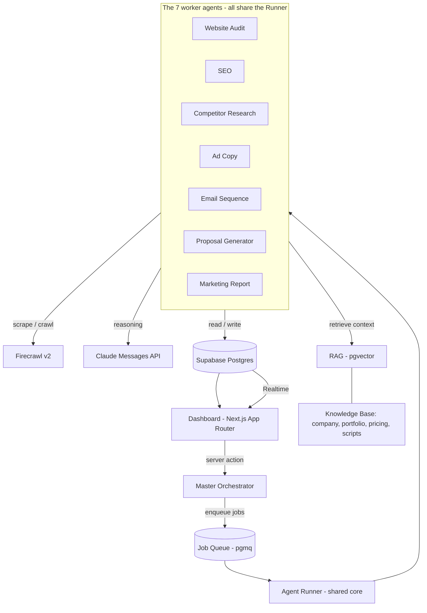

# WEBRO AI Marketing OS — System Architecture

**Version:** 0.1 (design only — no code yet)
**Date:** 2026-07-05
**Author:** Architecture & engineering lead (AI)
**Status:** Awaiting your approval before Phase 0 build

---

## 0. How to read this document

This is the **complete architecture and folder structure** for the WEBRO AI Marketing OS. It is design-only: no modules are built yet. It exists so we agree on the skeleton *before* writing a line of production code, which is the single highest-leverage decision in the whole project.

The document is ordered so you can approve top-to-bottom:

1. Design principles (the rules everything obeys)
2. What we're building (the 8 modules, one picture)
3. Tech stack decisions — **every choice explained**, including two genuine forks
4. The reusable Agent Core (the heart of "make every component reusable")
5. The Master Orchestrator
6. Data model (Supabase)
7. **Complete folder structure** (annotated)
8. End-to-end data flow
9. Environment & configuration
10. Build roadmap (dependency-ordered, one module at a time)
11. Open decisions I need your call on
12. What happens the moment you approve

---

## 1. Design principles

These are non-negotiable rules the codebase enforces. Every later decision traces back to one of these.

1. **One agent = one contract.** Every agent has a typed input schema and a typed output schema (Zod). An agent is a pure-ish function `run(input) -> output`. This is what makes them reusable, testable, and composable.
2. **Reasoning is a dependency, not the architecture.** Claude is called *inside* agents through one thin client. Swapping a model, or even a provider, touches one file — not eight.
3. **Everything an agent does is logged.** Every run records model, tokens, cost, latency, input, output, and status to `agent_runs`. You cannot improve or price what you cannot see.
4. **Long work is a job, not a request.** Crawling a site and reasoning over it takes longer than an HTTP request should live. Agents are triggered, run in the background, and report back. The UI subscribes to results.
5. **The knowledge base is data, not prompts.** WEBRO's company info, portfolio, pricing, proposal template, and sales scripts live in the database as retrievable, embedded documents — not hard-coded into prompt strings.
6. **Secure by default.** Row-Level Security on every table, scoped to the WEBRO workspace/user. Service-role keys never touch the browser.
7. **Boring where it doesn't matter, sharp where it does.** Standard Next.js + Supabase conventions everywhere, so the novel value (the agents) is where the effort goes.

---

## 2. What we're building (one picture)

Eight modules. Seven are worker agents; one (the Orchestrator) conducts them.



The important insight in this picture: **the seven agents are not seven codebases.** They are seven small config-and-prompt packages that all run through *one* shared Runner, call *one* set of shared tools, and write to *one* data model. Adding a ninth agent later is a folder, not a rewrite.

---

## 3. Tech stack — every decision explained

### 3.1 The stack at a glance

| Layer | Choice | Version (Jul 2026) | Why |
|---|---|---|---|
| Framework | **Next.js (App Router)** | 16.2.x | Your requirement. Server Actions + Route Handlers give us both UI and agent-trigger endpoints in one deploy. Turbopack default, React 19.2. |
| Language | **TypeScript** (strict) | 5.x | Your requirement. Strict mode + Zod = the typed agent contracts principle #1 depends on. |
| Database / Auth / Storage | **Supabase** | current | Your requirement. Postgres + Auth + Storage + Realtime + **pgvector** (RAG) + **pgmq** (queues) + Edge Functions — one platform covers 80% of the backend. |
| Web data | **Firecrawl v2** (`@mendable/firecrawl-js`) | current | Your requirement. Turns any prospect site into clean, LLM-ready markdown. `scrape` for one page, `crawl` for a whole site, webhooks for async. |
| Reasoning | **Claude via Messages API** (`@anthropic-ai/sdk`) | current | Your requirement. See the fork in 3.2 — we use the Messages API, *not* the Agent SDK, and I explain why. |
| Validation | **Zod** | 3.x | The runtime backbone of typed agent I/O. |
| UI kit | **Tailwind + shadcn/ui** | current | Reusable, accessible component primitives so UI work is assembly, not CSS archaeology. |
| Server state | **TanStack Query** | v5 | Caching + Realtime-friendly data layer for the dashboard. |

### 3.2 Fork #1 — Messages API vs. Claude Agent SDK (decided: Messages API)

As of 2026 Anthropic ships two ways to use Claude programmatically, and picking the wrong one would shape the whole project:

- **Claude Agent SDK** (`@anthropic-ai/claude-agent-sdk`) — the same harness that powers Claude Code. It's brilliant for *autonomous coding-style agents* that read/write files, run bash, and roam. It brings its own agent loop, subagents, and CLI.
- **Messages API** (`@anthropic-ai/sdk`) — direct, typed request/response with tool-use and structured output.

**Decision: build the product on the Messages API.** Reasoning:

- Our agents are **bounded, deterministic tasks** with a defined input and a required output shape ("audit this site → return this JSON"). We want tight schemas, per-agent model choice, and predictable cost — not an open-ended autonomous loop.
- We want the orchestration logic to be **ours** (that's literally Module 1, the Master Orchestrator). The Agent SDK would supply its *own* opinionated loop and partly duplicate what you asked us to build.
- The Messages API drops cleanly into Next.js Route Handlers and Supabase Edge Functions with no extra runtime.

We keep the door open: the Agent SDK is the right tool later for *internal developer tooling* (e.g., an agent that writes new agents). It just shouldn't be the product's runtime. This is reversible — because of principle #2, it lives behind one client.

### 3.3 Fork #2 — how long-running agent work executes (recommended: in-stack queue first)

An agent that crawls a 40-page site and reasons over it can run for minutes. That cannot live inside a normal serverless request. Options:

- **A. In-stack** — a `jobs` table + **pgmq** (Supabase Queues), drained by a worker (Supabase Edge Function on a `pg_cron` schedule, or a Next.js worker route). Zero new vendors, fully inside your required stack.
- **B. Durable workflow engine** — Inngest or Trigger.dev. Best-in-class retries, step durability, and observability for multi-step AI pipelines, at the cost of one more platform.

**Recommendation: start with A** to honor "Next.js + Supabase + Firecrawl + Claude" as the whole stack, with the job layer abstracted (principle #4) so we can graduate to B if durability needs grow. **Flagged for your call in §11.**

### 3.4 Model routing (per-agent, cost-aware)

Claude is not one model; using the biggest everywhere is how you burn margin. Proposed default routing (final IDs to confirm against the live API at build time):

| Agent | Primary model | Why |
|---|---|---|
| Website Audit | `claude-sonnet-5` | Strong reasoning over messy scraped HTML/markdown. |
| SEO | `claude-sonnet-5` | Technical + content analysis. |
| Competitor Research | `claude-sonnet-5` (+ `claude-haiku-4-5` for bulk parsing) | Cheap model shreds many pages; strong model synthesizes. |
| Ad Copy | `claude-sonnet-5` (creative variant TBD) | Persuasive copy; a creative-tuned model may fit here — verify. |
| Email Sequence | `claude-sonnet-5` | Multi-step nurture logic + voice. |
| Proposal Generator | `claude-sonnet-5`, escalate to `claude-opus-4-8` for high-ticket | Highest-stakes output; worth the spend selectively. |
| Marketing Report | `claude-sonnet-5` (+ `claude-haiku-4-5` assembly) | Synthesis of prior structured outputs. |
| Orchestrator planner | `claude-sonnet-5` or **no LLM** (deterministic routing) | Most workflows are fixed recipes; LLM planning only when needed. |

Routing lives in `src/config/models.ts` — one file, changeable in seconds.

---

## 4. The reusable Agent Core (the heart of the system)

This is what makes "every component reusable" real. Every agent is defined by a small spec and executed by a shared Runner. No agent re-implements Claude calls, logging, retries, validation, or RAG.

### 4.1 The agent contract

```ts
// src/agents/core/types.ts  (illustrative — final in Phase 0)
export interface AgentSpec<TInput, TOutput> {
  name: string;                       // "website-audit"
  version: string;                    // "1.0.0"
  model: ModelId;                     // from config/models.ts
  input: z.ZodType<TInput>;           // validated before run
  output: z.ZodType<TOutput>;         // validated after run
  systemPrompt: string;               // from ./prompt.ts
  tools?: ToolName[];                 // reusable tools it may call
  ragNamespaces?: string[];           // knowledge-base scopes to retrieve
}

export interface AgentContext {
  workspaceId: string;
  leadId?: string;
  supabase: SupabaseClient;
  logger: RunLogger;
}
```

### 4.2 The Runner (one implementation, used by all agents)

```ts
// src/agents/core/runner.ts  (illustrative)
async function runAgent<I, O>(spec, input, ctx): Promise<O> {
  // 1. validate input against spec.input (Zod)
  // 2. optional: RAG retrieve context from spec.ragNamespaces (pgvector)
  // 3. call Claude (Messages API) with system prompt + tools + structured-output schema
  // 4. execute any tool-use calls via the shared tool registry, loop until done
  // 5. validate the model's result against spec.output (Zod) — repair-or-fail
  // 6. persist a row to agent_runs (model, tokens, cost, latency, status)
  // 7. return typed O
}
```

Every agent therefore ships only three-to-four tiny files:

```
agents/website-audit/
  index.ts     # export const websiteAuditAgent: AgentSpec<Input, Output>
  prompt.ts    # the system prompt
  schema.ts    # Zod input/output types
  tools.ts     # (optional) agent-specific tool wiring
```

### 4.3 Shared tools (a registry, not copy-paste)

Tools are reusable capabilities any agent can be granted: `firecrawl.scrape`, `firecrawl.crawl`, `web.search`, `rag.retrieve`, `db.write`. They live in `src/tools/`, are registered once, and are exposed to Claude as tool-use definitions by the Runner. Give the SEO agent `firecrawl.scrape` + `web.search`; give Proposal `rag.retrieve` — same code, different grant.

### 4.4 Telemetry

`src/agents/core/telemetry.ts` writes every run to `agent_runs` and computes cost from token counts × model price. This powers a future "cost per prospect / per proposal" view — critical for an agency selling on ROI.

---

## 5. The Master Orchestrator (Module 1)

The Orchestrator turns single agents into **workflows** — the actual product experiences.

- **Workflows** (`src/orchestrator/workflows.ts`) are declarative recipes. Example — *Full Prospect Workup*: `Website Audit → (Competitor Research ∥ SEO) → Marketing Report → Proposal Generator`. Steps declare dependencies; independent steps run in parallel.
- **State** (`src/orchestrator/state.ts`) is a `workflow_runs` row + per-step `job` records, so a workflow is resumable and observable, and the dashboard can render live progress.
- **Planner** (`src/orchestrator/planner.ts`) is *optional*. Most work is fixed recipes (deterministic, cheap, debuggable). We only invoke an LLM planner when a user asks for something open-ended. Deterministic-first is a deliberate choice: predictable and auditable beats clever.

**Sequencing note (important):** the *reusable core* the Orchestrator stands on (Runner, tools, job queue) is built in **Phase 0**. The Orchestrator's full workflow-composition layer only becomes useful once ≥2 agents exist to compose — so although it's "Module 1" in your list, its rich form lands near the end, after the agents. We build a minimal orchestrator early and grow it. (Open for your input in §11.)

---

## 6. Data model (Supabase / Postgres)

High-level tables. Every table has `workspace_id`, timestamps, and **RLS** scoped to the WEBRO workspace. `→` = foreign key.

| Table | Purpose | Key relations |
|---|---|---|
| `workspaces` | The WEBRO tenant (multi-tenant-ready from day 1). | — |
| `profiles` | Team users, linked to `auth.users`. | → workspace |
| `leads` | Prospect businesses: name, website, industry, location, contact, status, source. | → workspace |
| `audits` | Website audit output (design, speed, UX, mobile, trust — scored). | → lead |
| `seo_reports` | SEO findings and recommendations. | → lead |
| `competitors` | Competitor records + comparison notes. | → lead |
| `ad_copy` | Ad campaigns; `ad_variants` holds A/B variants. | → lead |
| `email_sequences` / `email_steps` | Nurture sequences and their ordered steps. | → lead |
| `proposals` | Generated sales proposals + pricing + status. | → lead |
| `reports` | Marketing Report Generator output (aggregate deliverable). | → lead |
| `documents` / `document_chunks` | Knowledge base: source docs + embedded chunks (**pgvector**). | → workspace |
| `agent_runs` | Observability: every agent execution's model, tokens, cost, latency, status. | → lead (nullable) |
| `workflows` / `workflow_runs` | Orchestrator definitions and executions. | → workspace |
| `jobs` | Async job records backing pgmq (status, attempts, payload). | → workflow_run |

**RAG design:** the five knowledge files you scaffolded (`company_info`, `portfolio`, `pricing`, `proposal_template`, `sales_scripts`) are ingested into `documents` + `document_chunks`, embedded, and retrieved by the Proposal, Email, and Ad Copy agents so their output sounds like WEBRO — not generic AI. This is why those placeholders exist, and where they plug in.

---

## 7. Complete folder structure

Single Next.js app with hard internal boundaries (simpler than a monorepo now; structured to graduate to one later — see §11). Annotated:

```
webro-ai-os/
├─ src/
│  ├─ app/                         # Next.js App Router
│  │  ├─ (auth)/                   # login, callback
│  │  ├─ (dashboard)/              # authenticated product
│  │  │  ├─ leads/                 # lead list + detail
│  │  │  ├─ audits/
│  │  │  ├─ proposals/
│  │  │  ├─ reports/
│  │  │  ├─ workflows/             # orchestrator runs + live progress
│  │  │  └─ settings/              # knowledge base, API keys, team
│  │  ├─ api/                      # Route Handlers
│  │  │  ├─ agents/[agent]/route.ts    # trigger a single agent
│  │  │  ├─ workflows/[id]/route.ts    # trigger a workflow
│  │  │  ├─ jobs/worker/route.ts       # drain the queue (option A)
│  │  │  └─ webhooks/firecrawl/route.ts# async crawl completion
│  │  ├─ layout.tsx
│  │  └─ page.tsx
│  ├─ proxy.ts                     # Next 16 middleware → Supabase session refresh
│  │
│  ├─ agents/                      # ── THE AGENTS (reusable) ──
│  │  ├─ core/                     # BaseAgent spec, Runner, registry, telemetry, types
│  │  ├─ website-audit/            # index • prompt • schema • tools
│  │  ├─ seo/
│  │  ├─ competitor-research/
│  │  ├─ ad-copy/
│  │  ├─ email-sequence/
│  │  ├─ proposal-generator/
│  │  └─ marketing-report/
│  │
│  ├─ orchestrator/                # Master Orchestrator: workflows • planner • state
│  │
│  ├─ tools/                       # reusable agent tools (Claude tool-use impls)
│  │  ├─ firecrawl-scrape.ts
│  │  ├─ firecrawl-crawl.ts
│  │  ├─ web-search.ts
│  │  ├─ rag-retrieve.ts
│  │  └─ db-write.ts
│  │
│  ├─ lib/                         # thin clients & infra (principle #2)
│  │  ├─ supabase/                 # client.ts • server.ts • admin.ts
│  │  ├─ claude/                   # client.ts • tool-use.ts
│  │  ├─ firecrawl/                # client.ts
│  │  ├─ rag/                      # embed.ts • ingest.ts • retrieve.ts
│  │  ├─ jobs/                     # queue.ts • worker.ts
│  │  └─ utils/
│  │
│  ├─ components/                  # UI (reusable)
│  │  ├─ ui/                       # shadcn/ui primitives
│  │  ├─ leads/  agents/  workflows/  shared/
│  │
│  ├─ config/                      # env.ts • models.ts • constants.ts
│  ├─ types/                       # global types + generated Supabase types
│  └─ styles/
│
├─ supabase/
│  ├─ migrations/                  # SQL schema, RLS, pgvector, pgmq
│  ├─ functions/                   # Edge Functions (workers, cron)
│  └─ seed.sql
│
├─ knowledge-base/                 # WEBRO source docs → ingested to pgvector
│  ├─ company_info.md
│  ├─ portfolio.md
│  ├─ pricing.md
│  ├─ proposal_template.md
│  └─ sales_scripts.md
│
├─ scripts/                        # ingest-knowledge • gen-db-types • seed
├─ tests/                          # unit (agents/tools) + integration
├─ .env.example
├─ next.config.ts
├─ tsconfig.json
├─ package.json
└─ README.md
```

Two things to notice: agents, tools, and lib are **siblings**, not nested — an agent imports a tool and a client, never another agent. And the UI (`app/`, `components/`) never imports an agent directly; it goes through the orchestrator/API. Clean layers, no cycles.

---

## 8. End-to-end data flow (example: "Full Prospect Workup")

1. In the dashboard you add a **lead** (a business website URL) and click *Run full workup*.
2. A **Server Action** creates a `workflow_run` and enqueues its first job(s) into **pgmq**.
3. The **worker** picks up the job and invokes the **Website Audit Agent** via the Runner: Firecrawl `crawl` → Claude (Sonnet 5) analyzes → structured audit saved to `audits`; `agent_runs` logged.
4. On completion the Orchestrator enqueues the next steps — **Competitor Research** and **SEO** run **in parallel** (independent), then **Marketing Report** (depends on both).
5. **Proposal Generator** runs last: it `rag.retrieve`s WEBRO's pricing, portfolio, and proposal template, combines them with the audit + report, and writes a `proposals` row.
6. Throughout, the dashboard is subscribed via **Supabase Realtime**, so each result and progress bar updates live — no refresh.

The same Runner, tools, and data model serve every step. That is the reuse paying off.

---

## 9. Environment & configuration

`.env.example` (names only — no secrets committed):

```
# Supabase
NEXT_PUBLIC_SUPABASE_URL=
NEXT_PUBLIC_SUPABASE_ANON_KEY=
SUPABASE_SERVICE_ROLE_KEY=        # server-only, never shipped to browser
# Claude
ANTHROPIC_API_KEY=
# Firecrawl
FIRECRAWL_API_KEY=
# App
APP_URL=
```

`src/config/env.ts` validates these at boot with Zod, so a missing key fails fast and loud instead of at 2am inside an agent.

---

## 10. Build roadmap (one module at a time — you approve each)

Dependency-ordered. Each phase ends at a working checkpoint; I stop and wait for your approval before the next, per your instruction.

- **Phase 0 — Foundation** (the runway). Repo + Next 16 + TS strict; Supabase project, schema, RLS, pgvector, pgmq; `lib/` clients (Supabase, Claude, Firecrawl); the **Agent Core** (Runner, registry, telemetry); job queue + worker; knowledge-base ingest; auth + dashboard shell. *No agent yet — but everything an agent needs.*
- **Phase 1 — Website Audit Agent.** First real vertical slice; proves Firecrawl → Claude → typed output → DB → UI end-to-end.
- **Phase 2 — SEO Agent.**
- **Phase 3 — Competitor Research Agent.**
- **Phase 4 — Ad Copy Agent.**
- **Phase 5 — Email Sequence Agent.**
- **Phase 6 — Proposal Generator Agent** (first heavy RAG consumer).
- **Phase 7 — Marketing Report Generator** (aggregates prior outputs).
- **Phase 8 — Master Orchestrator, full form** (composes all agents into workflows + live UI).

Why Audit before Orchestrator, when Orchestrator is your Module 1: you can't conduct an orchestra with no instruments. We build the orchestrator's *foundation* in Phase 0 and its *composition layer* in Phase 8 once there are agents to compose. If you'd rather build a thin orchestrator earlier, we can — see §11.

---

## 11. Open decisions — your call

I've made defaults for all of these so we're never blocked, but these four genuinely benefit from your input:

1. **Background jobs (§3.3):** start in-stack (pgmq + worker) [my rec] vs. adopt Inngest/Trigger.dev now for durability?
2. **Orchestrator sequencing (§5/§10):** build Audit Agent first and grow the orchestrator [my rec] vs. build a thin Master Orchestrator up front?
3. **Repo shape (§7):** single Next.js app with strict internal boundaries [my rec, simpler] vs. Turborepo monorepo with agents as publishable packages (heavier, but maximal reuse)?
4. **UI scope for v1:** full operational dashboard (leads, runs, proposals, reports) vs. minimal internal console first, polish later?

---

## 12. What happens the moment you approve

On your "go," Phase 0 begins: I scaffold the exact tree in §7, stand up the Supabase schema + RLS, wire the three `lib/` clients, and implement the Agent Core + job queue — ending at a running dashboard with zero agents but a green end-to-end pipeline (a trivial "hello agent" proving the Runner works). Then I stop for your review before Phase 1.

Nothing is built until you approve this architecture. Tell me: **approve as-is**, or give me your calls on §11 and any changes, and I'll adjust the design first.
